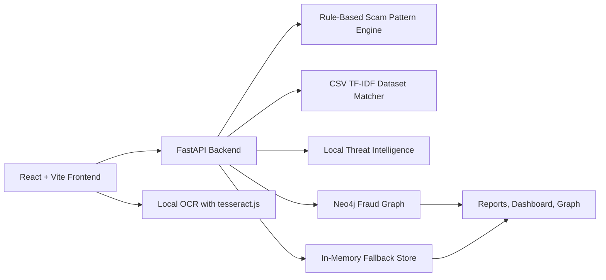

# Sentinel AI

**ET AI Hackathon 2026 - PS 6: AI for Digital Public Safety - Defeating Counterfeiting, Fraud & Digital Arrest Scams**

Sentinel AI converts every citizen report into graph intelligence so one victim's report protects the next victim.

## Features

- Analyze suspicious messages from manual text input.
- Upload WhatsApp, SMS, email, or UPI payment screenshots and extract text locally with OCR.
- Classify digital arrest scams, fake KYC, UPI fraud, job scams, investment scams, loan scams, courier scams, bank freeze scams, and reward scams.
- Explain every result with risk score breakdown, red flags, recommendations, and incident report.
- Match messages against a local fraud-pattern CSV knowledge base using TF-IDF cosine similarity.
- Save reports to Neo4j when configured, with in-memory fallback when credentials are missing.
- Detect repeated scam entities across reports: phone numbers, UPI IDs, URLs, and emails.
- Show reports, dashboard analytics, and fraud network graph.
- Optional LLM classifier hook via `OPENAI_API_KEY` or `GEMINI_API_KEY`; deterministic rule-based analysis works without keys.

## Architecture



## Tech Stack

Frontend:
- React + Vite
- Tailwind CSS
- Axios
- Recharts
- React Flow
- tesseract.js

Backend:
- FastAPI
- Pydantic
- Neo4j Python driver
- Local CSV fraud-pattern dataset
- Optional OpenAI/Gemini API integration

Storage:
- Neo4j graph database when configured
- In-memory fallback when Neo4j credentials are missing

## Folder Structure

```text
.
├── AGENTS.md
├── README.md
├── .env.example
├── backend
│   ├── .env.example
│   ├── requirements.txt
│   ├── data
│   │   └── sentinel_ai_fraud_scam_messages_dataset.csv
│   └── app
│       ├── main.py
│       ├── schemas.py
│       ├── database.py
│       ├── models.py
│       └── services
│           ├── analyzer.py
│           ├── dataset_matcher.py
│           ├── graph_db.py
│           ├── llm_classifier.py
│           ├── scam_patterns.py
│           └── threat_intel.py
└── frontend
    ├── .env.example
    ├── package.json
    ├── vite.config.js
    └── src
        ├── App.jsx
        ├── api.js
        └── pages
            ├── AnalyzePage.jsx
            ├── DashboardPage.jsx
            ├── FraudGraphPage.jsx
            └── ReportsPage.jsx
```

## Setup

### Backend

```powershell
cd backend
python -m venv .venv
.\.venv\Scripts\Activate.ps1
python -m pip install -r requirements.txt
python -m uvicorn app.main:app --reload
```

Backend runs at:

```text
http://127.0.0.1:8000
```

API docs:

```text
http://127.0.0.1:8000/docs
```

### Frontend

```powershell
cd frontend
npm install
npm run dev
```

Frontend runs at:

```text
http://localhost:5173
```

### Neo4j With Docker

```powershell
docker run --name sentinel-neo4j -p 7474:7474 -p 7687:7687 -e NEO4J_AUTH=neo4j/sentinel123 neo4j:5-community
```

Set backend environment variables:

```powershell
$env:NEO4J_URI="bolt://localhost:7687"
$env:NEO4J_USERNAME="neo4j"
$env:NEO4J_PASSWORD="sentinel123"
```

If these variables are missing or Neo4j is unavailable, Sentinel AI uses in-memory storage so the app still runs locally.

## Environment Variables

Backend:

```text
NEO4J_URI=bolt://localhost:7687
NEO4J_USERNAME=neo4j
NEO4J_PASSWORD=sentinel123
OPENAI_API_KEY=
OPENAI_MODEL=gpt-4.1-mini
GEMINI_API_KEY=
GEMINI_MODEL=gemini-1.5-flash
```

Frontend:

```text
VITE_API_BASE_URL=http://127.0.0.1:8000
```

OpenAI/Gemini keys are optional. If no key exists, the deterministic rule-based analyzer is used.

## API Endpoints

- `GET /api/health` - backend health check
- `POST /api/analyze` - analyze suspicious text and save report
- `GET /api/reports` - list saved reports
- `GET /api/dashboard` - report analytics
- `GET /api/graph` - fraud intelligence graph nodes and edges

Analyze request:

```json
{
  "text": "message here",
  "city": "Mumbai"
}
```

Analyze response includes:

- `risk_score`
- `risk_score_breakdown`
- `verdict`
- `scam_type`
- `red_flags`
- `extracted_entities`
- `ai_pattern_summary`
- `dataset_match_summary`
- `matched_reports_count`
- `repeated_entities`
- `graph_match_summary`
- `recommendation`

## Demo Flow

1. Start backend and frontend.
2. Open the Analyze page.
3. Paste a suspicious message or upload a screenshot.
4. Review scam type, verdict, risk score breakdown, AI pattern analysis, dataset match, graph match, red flags, and recommendations.
5. Analyze another message with the same UPI/phone/link to show graph intelligence and repeated entity risk increase.
6. Open Reports to show saved incidents.
7. Open Dashboard to show report analytics.
8. Open Graph to show connected reports, cities, scam types, phones, UPI IDs, URLs, and emails.

## Test Messages

Safe message:

```text
Hi, can we meet tomorrow at 4 PM to discuss the project update?
```

Expected:
- Low risk
- Scam type: `Safe / Normal Message`
- No database match required message may show no pattern match

Job scam:

```text
Hello, I came across your profile on LinkedIn and believe your experience aligns well with a remote Customer Support Specialist position. The salary is $60,000 per year. Do you want to hear more?
```

Expected:
- Scam type: `Job / Recruitment Scam`
- Verdict: `Suspicious`
- Risk score around `45-60`
- Red flags for unsolicited job offer, attractive remote salary, vague recruiter identity, and informal process

Digital arrest scam:

```text
CBI says you are under digital arrest. Pay 5000 to verifyfast@upi or call +91 9876543210 immediately. Visit rbi-verify-payment.com
```

Expected:
- Scam type: `Digital Arrest Scam`
- High risk
- Risk score breakdown includes digital arrest, law enforcement, payment, urgency, entity intelligence, and possible graph match

Fake KYC scam:

```text
Dear customer your bank KYC has expired. Update immediately or your account will be blocked today.
```

Expected:
- Scam type: `Fake KYC Scam`
- Dataset match summary with similar CSV examples
- Risk score boosted by pattern knowledge match

## Validation Commands

Backend health:

```powershell
curl.exe http://127.0.0.1:8000/api/health
```

Analyze safe message:

```powershell
curl.exe -X POST "http://127.0.0.1:8000/api/analyze" -H "Content-Type: application/json" -d "{\"text\":\"Hi, can we meet tomorrow at 4 PM to discuss the project update?\",\"city\":\"Mumbai\"}"
```

Analyze job scam:

```powershell
curl.exe -X POST "http://127.0.0.1:8000/api/analyze" -H "Content-Type: application/json" -d "{\"text\":\"Hello, I came across your profile on LinkedIn and believe your experience aligns well with a remote Customer Support Specialist position. The salary is $60,000 per year. Do you want to hear more?\",\"city\":\"Mumbai\"}"
```

Analyze digital arrest scam:

```powershell
curl.exe -X POST "http://127.0.0.1:8000/api/analyze" -H "Content-Type: application/json" -d "{\"text\":\"CBI says you are under digital arrest. Pay 5000 to verifyfast@upi or call +91 9876543210 immediately. Visit rbi-verify-payment.com\",\"city\":\"Delhi\"}"
```

Frontend build:

```powershell
cd frontend
npm run build
```

## Judging Criteria Alignment

Relevance:
- Directly addresses digital arrest scams, payment fraud, fake KYC, job scams, suspicious messages, and scam networks.

Innovation:
- Converts every report into graph intelligence so repeated entities can protect future users.
- Combines rule-based AI patterns, local dataset similarity, threat intelligence, OCR, and graph matching.

Technical Implementation:
- Working React/FastAPI prototype.
- Explainable risk scoring.
- Neo4j integration with local fallback.
- OCR processed locally; only extracted text is analyzed.

Business Viability:
- Can be positioned for banks, cyber cells, public safety teams, campus awareness drives, and consumer protection workflows.
- Uses optional integrations and local fallback to reduce deployment friction.

Presentation Clarity:
- Dashboard, reports, graph, and incident report provide judge-friendly demo artifacts.

Impact and Scalability:
- One report enriches future detection through graph intelligence.
- Dataset and threat intelligence layers can later connect to verified official sources when available.

## Limitations

- The built-in CSV is a demo knowledge base, not an official government dataset.
- OCR quality depends on screenshot clarity.
- Rule-based classification can produce false positives or miss novel scam language.
- In-memory fallback does not persist after backend restart.
- Optional LLM classification is not used unless an API key is configured.

## Future Scope

- Connect verified sources such as I4C suspect repositories, Chakshu, and RBI Sachet when official access is available.
- Add investigator workflow for entity review and case export.
- Add multilingual OCR and scam pattern support.
- Add PDF export for incident reports.
- Add role-based authentication only when required for deployment.

## Screenshots

Add final demo screenshots here before submission:

- Analyze page
- OCR upload
- Risk score breakdown
- Reports page
- Dashboard
- Fraud graph

